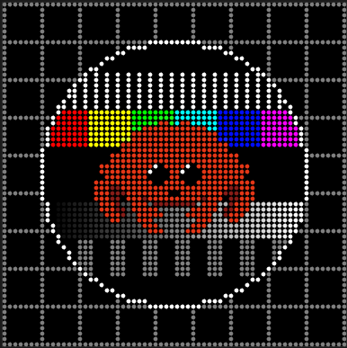

    

# 🦀 Raspberry Pi LED Matrix

A Rust rewrite of the fantastic [rpi-rgb-led-matrix](https://github.com/hzeller/rpi-rgb-led-matrix) library. Use this if you want something that is easy to integrate into your Rust project but don't mind it being mostly untested. Contributions are welcome.

See the [examples](examples) to get started. You can run any of them with `--help` to get a list of command line arguments. See the [original readme](https://github.com/hzeller/rpi-rgb-led-matrix) for more information.
